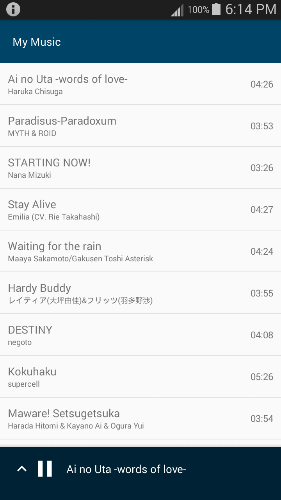
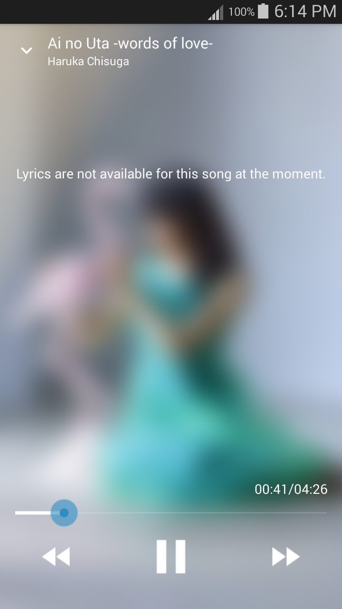
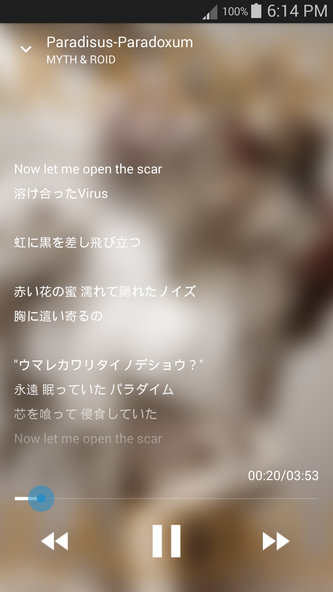

# Lyriq

An Android music player that automatically fetches and displays the lyrics for a track if available. This application uses the [Musixmatch Developer API](https://developer.musixmatch.com/) for the lyrics database source.

 

 

## Usage

In order to use the API, you must have an API key. You can get one over [here](https://developer.musixmatch.com/plans).

Modify `app/src/main/res/values/strings.xml` to contain your API key.
